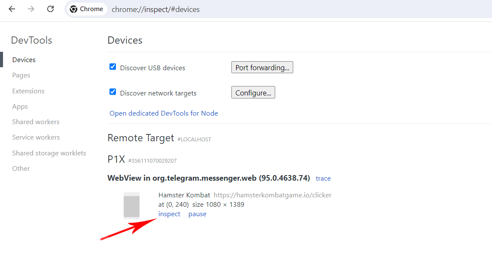

# Guide on extracting authToken on Android

## Steps

### 1. Enable Developer Mode and USB Debugging

1. Go to **Settings** on your Android device.
2. Find **About phone** or **About tablet**.
3. Tap on **Build number** several times (typically 7 times) until you see "You are now a developer".
4. Go back to **Settings** and find the new **Developer options** section.
5. Enable **Developer mode** and **USB debugging**.

### 2. Enable Debugging Mode in Telegram

1. Open Telegram on your device.
2. Go to **Settings**.
3. Scroll down to the bottom and long press two times on **Telegram Version**.
4. In the menu that appears, select **Enable Web View Inspecting**.

### 3. Connect Device to PC

1. Connect your Android device to your computer using a USB cable.
2. You will see a prompt on your device to allow USB debugging - confirm it.

### 4. Open DevTools in Chrome

1. Open Google Chrome on your PC.
2. Enter `chrome://inspect/#devices` in the address bar and press Enter.

### 5. Debug Web View

1. On your device, open Telegram and navigate to the HamsterKombat bot.
2. In Chrome, find your device in the list and choose any of the available Hamster Kombat processes. 
3. Click on **inspect**.

### 6. Using DevTools

1. DevTools will open in a new window. Go to the **Network** tab. 

2. Go to the **earn** tab to generate an HTTP request. 

3. Enter `list-task` in the search bar and select the `Fetch/XHR` filter. 

4. Click on the request to open the interaction menu with the HTTP request. 

5. In the opened window, under **Headers**, navigate to **Request Headers**. 

6. Copy the token in the **Authorization:** attribute and remove `Bearer`, leaving only the token.
   For example: `Bearer 9aFJ6C29b81cLmR04DKq7fXzQi52tHOG8e7R9vUj6iPcYwTxN0uMbA3SdV5Ks2WjMnLv8qZoJ3F1rY46tQm9` should become `9aFJ6C29b81cLmR04DKq7fXzQi52tHOG8e7R9vUj6iPcYwTxN0uMbA3SdV5Ks2WjMnLv8qZoJ3F1rY46tQm9`.
   This is your token. 

7. Copy headers `User-Agent`, `Sec-Ch-Ua`, They may be useful for running the bot.
